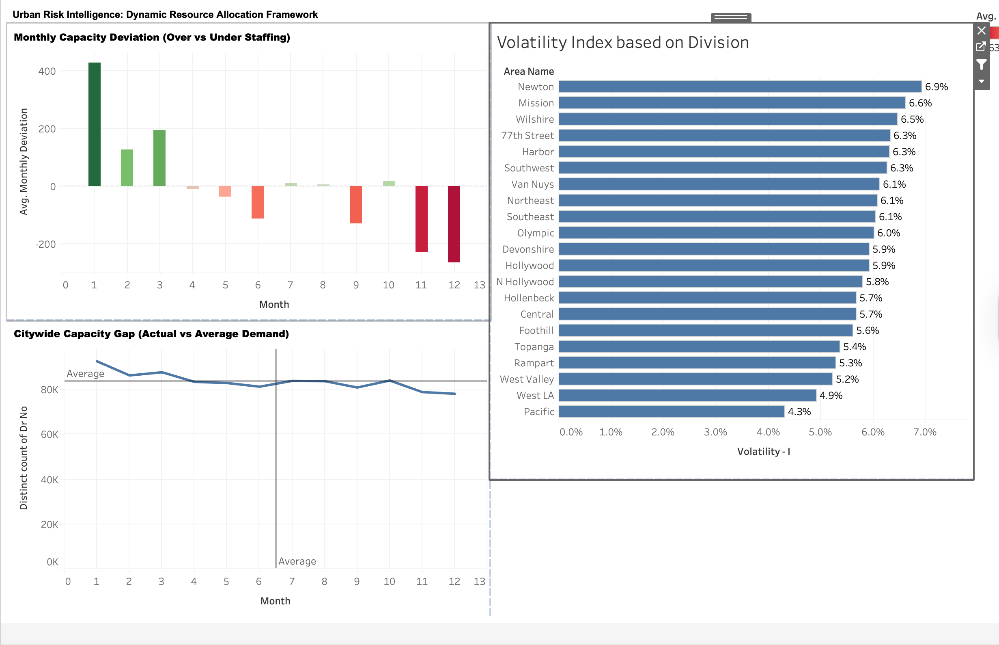

# LA Crime Data Warehouse – Star Schema Implementation

## Project Overview

This project builds a dimensional star schema data warehouse using the Los Angeles Crime Dataset.  
The goal was to transform raw crime data into a structured analytics-ready model suitable for BI tools such as Power BI and Excel.

The project demonstrates:
- Dimensional modeling (Star Schema)
- Data cleaning & normalization
- Surrogate key generation
- Handling unknown/missing values
- Fact-to-dimension relationships
- Data quality validation
- Index optimization

---

## Architecture

Raw Layer:
- Raw.la_crime_raw

Analytics Layer:
- Analytics.dim_date
- Analytics.dim_area
- Analytics.dim_crime
- Analytics.dim_premis
- Analytics.dim_weapon
- Analytics.dim_status
- Analytics.dim_age_group
- Analytics.fact_crime

The model follows a classic **star schema design**, with `fact_crime` at the center and surrounding dimension tables.

---

## Fact Table

### fact_crime
Primary Key:
- dr_no

Foreign Keys:
- date_key
- area_key
- crime_key
- premis_key
- weapon_key
- status_key
- age_group_key

Additional Measures:
- time_occ
- vict_age
- vict_sex
- vict_descent
- lat
- lon
- crm_cd_1 – crm_cd_4

---

## Dimension Tables

### dim_date
- Date breakdown (year, month, day, day_of_week)

### dim_area
- Area ID, name, reporting district

### dim_crime
- Crime code and standardized description  
- Most common description selected per crime code

### dim_premis
- Premise code and description  
- Deduplicated and standardized

### dim_weapon
- Weapon code and description  
- Deduplicated per code

### dim_status
- Normalized status values (UPPER/TRIM applied)

### dim_age_group
- Custom age buckets:
  - 0–17
  - 18–24
  - 25–34
  - 35–44
  - 45–54
  - 55–64
  - 65+
  - UNKNOWN / NOT PROVIDED

---

## Data Engineering Techniques Used

- `ROW_NUMBER()` window functions to select dominant descriptions per code
- `ON CONFLICT DO NOTHING` for idempotent loads
- Surrogate keys using SERIAL
- Left joins with unknown-member mapping (-1 / 'UNK')
- Age band mapping logic
- Null handling & default dimension members
- Index creation for performance optimization
- Data validation queries for quality assurance

---

## Data Quality Validation

The script includes validation queries to ensure:

- Fact row count matches raw dataset
- No null foreign keys
- Unknown mappings are properly assigned
- Referential integrity maintained

---

## Business Intelligence Integration

The final star schema is designed to integrate directly with:

- Power BI
- Excel Pivot Tables
- Tableau
- Any SQL-based BI platform

The structure enables efficient reporting such as:
- Crime trends over time
- Area-level comparisons
- Weapon usage analysis
- Demographic crime distribution
- Weekend vs weekday behavior

## Phase 2: Exploratory Data Analysis & Feature Engineering

After constructing the warehouse in PostgreSQL, I exported the Analytics Layer to Excel to perform advanced feature engineering and statistical validation. This phase focused on identifying high-intensity risk zones and seasonal volatility.
Excel was used for feature engineering and statistical calculations due to its flexibility in creating custom metrics, pivot-based aggregation, and rapid validation of analytical assumptions.
Bar charts were used to visualize weapon density across premises and divisions, enabling clear comparison of high-risk categories.

### 1. Feature Engineering: Weapon Risk Intensity
To differentiate between "high-volume" crime areas and "high-risk" crime areas, I engineered a Weapon Flag:

Logic: Engineered a binary risk indicator using a nested Excel logical formula to handle data inconsistencies and missing values:
=IF(OR(ISBLANK([@[weapon_desc]]), LEFT([@[weapon_desc]], 7)="UNKNOWN", [@[weapon_desc]]=""), 0, 1)

Metric: Calculated Weapon Involvement Probability (the average of the flag) to determine the likelihood of weapon presence in specific environments.

Finding: While "Streets" have the highest total crime volume, Sidewalks and MTA Buses are the highest-intensity risk environments, both showing a weapon involvement rate of 68%.

Localized Insight: Using Tableau to drill down into this metric, I discovered that risk is not uniform across the city; for example, Hospitals show a massive variance in weapon probability—ranging from 25% to 80%—depending on the specific division (e.g., Hollywood vs. Southeast).

### 2. Statistical Analysis: Volatility & Resource Allocation
I analyzed crime trends (2020–2025) to determine how the LAPD should allocate resources dynamically.
* **Coefficient of Variation (CV):** I calculated the CV (Standard Deviation / Mean) to normalize volatility across divisions with different crime volumes.
* **Finding:** High CV scores in divisions like **Southwest** and **77th Street** indicate higher unpredictability month-to-month, suggesting these areas require more flexible staffing models compared to more "stable" divisions.

### 3. Data Integrity & Volume Thresholds
To ensure the findings were statistically sound and not skewed by outliers:
* **Premise Filter:** Only included premises with **> 1,000 incidents** (Filtered via Excel Pivot Tables).
* **Area Filter:** Focused on divisions with **> 45,000 incidents** to ensure large-scale significance.

---

---
---

## Phase 3: Analytical Insights & Business Recommendations

### Analysis 1: Seasonal Volatility & Dynamic Resource Allocation

#### Business Question  
Which LAPD divisions experience the greatest seasonal volatility in crime incidents, and how should resources be allocated dynamically?

---

#### Methodology  

- Aggregated monthly crime counts by division using SQL and Excel Pivot Tables  
- Calculated **Volatility (Standard Deviation)** across months  
- Computed **Volatility Index (Coefficient of Variation)**:

```excel
Volatility = STDEV.S(Monthly Crime Counts)
Volatility Index = Volatility / AVERAGE(Monthly Crime Counts)
```
## Key Visualization

The dashboard below highlights division-level volatility alongside monthly capacity gaps and citywide demand trends. 

- High volatility divisions such as Newton and Mission indicate unstable crime patterns.
- Monthly deviation shows clear overstaffing (positive) and understaffing (negative) periods.
- Citywide demand remains relatively stable, suggesting that volatility is localized rather than systemic.



## File Structure

- la_crime_star_schema.sql → Full ETL and warehouse creation script
- README.md → Project documentation

---

## Key Learning Outcomes

This project demonstrates:

✔ End-to-end warehouse creation  
✔ Dimensional modeling principles  
✔ Handling messy real-world public datasets  
✔ Preparing data for BI tools  
✔ Writing production-style SQL  

---

## Author

Sagarika Basnyat   
